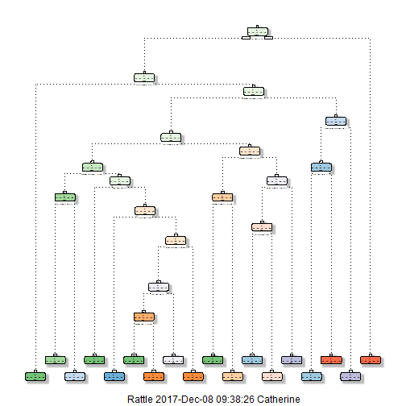

## Machine Learning Project
  
  P.Y.  
  12/8/2017  
  
  
  
### Introduction  
  
#### Background
  
Using devices such as Jawbone Up, Nike FuelBand, and Fitbit it is now possible to collect a large amount of data about personal activity relatively inexpensively. These type of devices are part of the quantified self movement - a group of enthusiasts who take measurements about themselves regularly to improve their health, to find patterns in their behavior, or because they are tech geeks. One thing that people regularly do is quantify how much of a particular activity they do, but they rarely quantify how well they do it. In this project, your goal will be to use data from accelerometers on the belt, forearm, arm, and dumbell of 6 participants. They were asked to perform barbell lifts correctly and incorrectly in 5 different ways. More information is available from the website here: http://web.archive.org/web/20161224072740/http:/groupware.les.inf.puc-rio.br/har (see the section on the Weight Lifting Exercise Dataset).
  
  
#### Data
  
The training data for this project are available here: https://d396qusza40orc.cloudfront.net/predmachlearn/pml-training.csv
  
The test data are available here:
https://d396qusza40orc.cloudfront.net/predmachlearn/pml-testing.csv
  
The data for this project come from this source: http://web.archive.org/web/20161224072740/http:/groupware.les.inf.puc-rio.br/har. If you use the document you create for this class for any purpose please cite them as they have been very generous in allowing their data to be used for this kind of assignment.
  
  
  
### Analysis
  
#### Reproduceability
  
Load the following libraries and set the seed

```r
library(lattice)
library(ggplot2)
```

```
## Warning: package 'ggplot2' was built under R version 3.4.2
```

```
## Need help? Try the ggplot2 mailing list:
## http://groups.google.com/group/ggplot2.
```

```r
library(caret)
```

```
## Warning: package 'caret' was built under R version 3.4.2
```

```r
library(rattle)
```

```
## Warning: package 'rattle' was built under R version 3.4.2
```

```
## Rattle: A free graphical interface for data science with R.
## XXXX 5.1.0 Copyright (c) 2006-2017 Togaware Pty Ltd.
## Type 'rattle()' to shake, rattle, and roll your data.
```

```r
library(rpart)
library(randomForest)
```

```
## Warning: package 'randomForest' was built under R version 3.4.2
```

```
## randomForest 4.6-12
```

```
## Type rfNews() to see new features/changes/bug fixes.
```

```
## 
## Attaching package: 'randomForest'
```

```
## The following object is masked from 'package:rattle':
## 
##     importance
```

```
## The following object is masked from 'package:ggplot2':
## 
##     margin
```

```r
set.seed(1234)
```
  
  
#### Loading and Cleaning Data  
  

```r
# load data into R

trainset <- read.csv("C:/Users/Catherine/Documents/R/Course 8/assignment/pml-training.csv", na.strings=c("NA","#DIV/0!",""))
testset <- read.csv("C:/Users/Catherine/Documents/R/Course 8/assignment/pml-testing.csv", na.strings=c("NA","#DIV/0!",""))

# keep columns with values (delete columns with all missing values)

trainset <- trainset[ , colSums(is.na(trainset))==0]
testset <- testset[ , colSums(is.na(testset))==0]

# delete variables that are irrelevant to the analysis (the first 7 columns)

trainset <- trainset[ , -c(1:7)]
testset <- testset[ , -c(1:7)]

# take a look at the structure of two data sets
str(trainset)
str(testset)
```
  
  
#### Cross Validation
  
To perform cross validation, the trainset is partionned into two parts: training(70%) and testing(30%)  
  

```r
inTrain <- createDataPartition(y=trainset$classe, p=0.7, list=FALSE)
training <- trainset[inTrain, ]
testing <- trainset[-inTrain, ]
```
  
  
#### MODEL 1: Decision Tree  
  

```r
# fit the model using the random forest method and print the tree
fit1 <- rpart(classe~., data = training, method = "class")
fancyRpartPlot(fit1)
```



```r
# predict new values on testing data set
pred1 <- predict(fit1, newdata = testing, type="class")

# test results on testing data set
confusionMatrix(pred1, testing$classe)
```

```
## Confusion Matrix and Statistics
## 
##           Reference
## Prediction    A    B    C    D    E
##          A 1364  169   24   48   16
##          B   60  581   46   79   74
##          C   52  137  765  129  145
##          D  183  194  125  650  159
##          E   15   58   66   58  688
## 
## Overall Statistics
##                                           
##                Accuracy : 0.6879          
##                  95% CI : (0.6758, 0.6997)
##     No Information Rate : 0.2845          
##     P-Value [Acc > NIR] : < 2.2e-16       
##                                           
##                   Kappa : 0.6066          
##  Mcnemar's Test P-Value : < 2.2e-16       
## 
## Statistics by Class:
## 
##                      Class: A Class: B Class: C Class: D Class: E
## Sensitivity            0.8148  0.51010   0.7456   0.6743   0.6359
## Specificity            0.9390  0.94543   0.9047   0.8657   0.9590
## Pos Pred Value         0.8415  0.69167   0.6230   0.4958   0.7774
## Neg Pred Value         0.9273  0.88940   0.9440   0.9314   0.9212
## Prevalence             0.2845  0.19354   0.1743   0.1638   0.1839
## Detection Rate         0.2318  0.09873   0.1300   0.1105   0.1169
## Detection Prevalence   0.2754  0.14274   0.2087   0.2228   0.1504
## Balanced Accuracy      0.8769  0.72776   0.8252   0.7700   0.7974
```
  
  
#### MODEL 2: Random Forest  
  

```r
# fit the model using random forest method
fit2 <- randomForest(classe~., data=training, method="class")

# predict new values on testing data set
pred2 <- predict(fit2, newdata = testing, type = "class")

# test results on testing data set
confusionMatrix(pred2, testing$classe)
```

```
## Confusion Matrix and Statistics
## 
##           Reference
## Prediction    A    B    C    D    E
##          A 1674    5    0    0    0
##          B    0 1133    6    0    0
##          C    0    1 1020    4    0
##          D    0    0    0  959    1
##          E    0    0    0    1 1081
## 
## Overall Statistics
##                                           
##                Accuracy : 0.9969          
##                  95% CI : (0.9952, 0.9982)
##     No Information Rate : 0.2845          
##     P-Value [Acc > NIR] : < 2.2e-16       
##                                           
##                   Kappa : 0.9961          
##  Mcnemar's Test P-Value : NA              
## 
## Statistics by Class:
## 
##                      Class: A Class: B Class: C Class: D Class: E
## Sensitivity            1.0000   0.9947   0.9942   0.9948   0.9991
## Specificity            0.9988   0.9987   0.9990   0.9998   0.9998
## Pos Pred Value         0.9970   0.9947   0.9951   0.9990   0.9991
## Neg Pred Value         1.0000   0.9987   0.9988   0.9990   0.9998
## Prevalence             0.2845   0.1935   0.1743   0.1638   0.1839
## Detection Rate         0.2845   0.1925   0.1733   0.1630   0.1837
## Detection Prevalence   0.2853   0.1935   0.1742   0.1631   0.1839
## Balanced Accuracy      0.9994   0.9967   0.9966   0.9973   0.9994
```
  
  
#### Final Decision on Model
  
The accuracy for the decision tree model is 0.6879 with 95% CI (0.6758, 0.6997)     
The accuracy for the random forest model is 0.9963 with 95% CI(0.9943, 0.9977)  
Thus, I choose random forest method to use  
  
Now, apply the Model 2: random forest on the testset

```r
pred3 <- predict(fit2, newdata = testset, type="class")
pred3
```

```
##  1  2  3  4  5  6  7  8  9 10 11 12 13 14 15 16 17 18 19 20 
##  B  A  B  A  A  E  D  B  A  A  B  C  B  A  E  E  A  B  B  B 
## Levels: A B C D E
```
  
  
